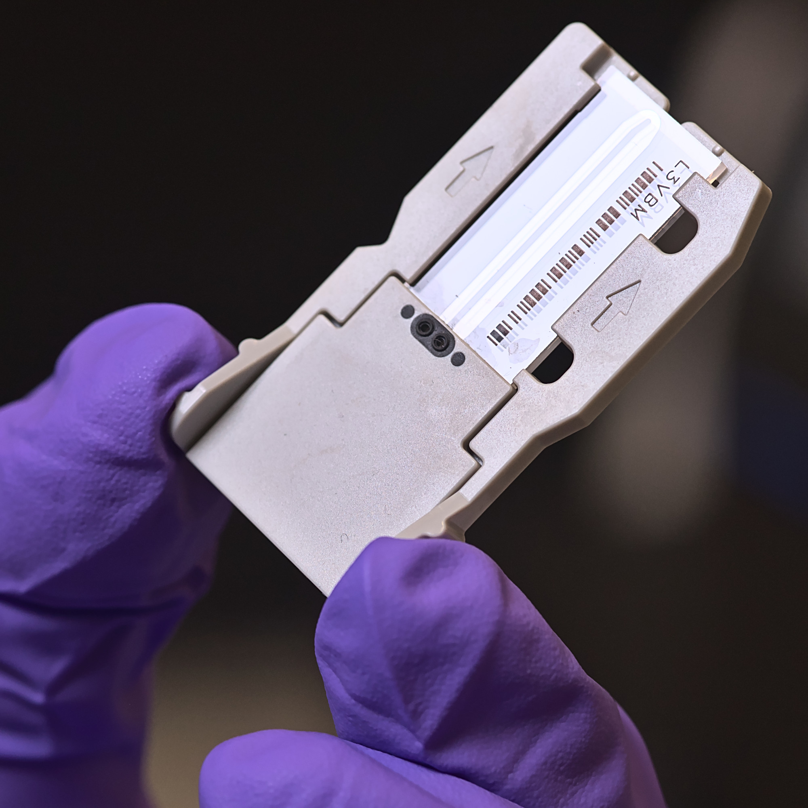

# 2001: A Base Odyssey
***The era of genomics and massive parallel sequencing***

This repository contains the slides, literature, and figures for the talk "2001: A Base Odyssey" about the era of genomics and massive parallel sequencing. It was delivered on February 24, 2025, by [Matthias Zepper](https://www.linkedin.com/in/matthias-zepper-05b752212/) at [SciLifeLab](https://www.scilifelab.se) in Stockholm.

The presentation explores the history and advancements in DNA sequencing, covering various next-generation sequencing (NGS) technologies, the data analysis and sequencing applications.

## Presentation slides

- The [presentation slides rendered to PDF](./SciLifeLab_2001ABaseOdyssey.pdf)
- The source file for the presentation is [`SciLifeLab_2001ABaseOdyssey.tex`](./SciLifeLab_2001ABaseOdyssey.tex).

To compile the slides, ensure you have LaTeX with Beamer installed. You will need BibLaTeX/Biber for bibliography management. Compile using `lualatex` or `xelatex` followed by `biber` and another LaTeX run.

> [!NOTE]
> The custom [_SciLifeLab_ theme](https://github.com/MatthiasZepper/beamer-scilifelab) is included in the repository. It uses the colors of [the official visual guide](https://www.scilifelab.se/community-pages/resources/visual-identity/), but not the font faces. The theme replaces Lato/Lora with [Biolinum by Philipp H. Poll](https://en.wikipedia.org/wiki/Linux_Libertine), which you may [have to install separately](https://ctan.org/pkg/libertine).

## Repository Structure

- **`./literature/`**: Includes the bibliography file `base-odyssey.bib` with references cited in the presentation.
- **`./figures/`**: Contains images and figures used in the slides.

## Summary of Presentation Content

1. **2001: Draft assemblies of the human genome are published**: Discusses the publication of the draft sequence of the human genome by Celera and the International Human Genome Sequencing Consortium.
2. **The overture to the genomic era**: Highlights the significance of the genomic era with a reference to Stanley Kubrick's "2001: A Space Odyssey."
3. **1968: Nobel prize for the interpretation of the genetic code**: Covers the Nobel prize awarded for the interpretation of the genetic code.
4. **Encoded information of naturally occurring DNA unknown**: Discusses the challenges of sequencing DNA in the early 1970s.
5. **1977: Chain-termination sequencing by Frederick Sanger**: Explains the development of the chain-termination sequencing method by Frederick Sanger.
6. **1980: Nobel prize for DNA sequencing**: Highlights the Nobel prize awarded for DNA sequencing.
7. **Advanced Sanger sequencing for the Human Genome Project**: Describes the advancements in Sanger sequencing used in the Human Genome Project.
8. **Next-generation sequencing**: Introduces new high-throughput sequencing methods developed around 2010.
9. **National Genomics Infrastructure Sweden**: Provides an overview of the National Genomics Infrastructure Sweden and its mission.
10. **Sequencing platforms**: Discusses various sequencing platforms and technologies used since Sanger sequencing.
11. **Sequencing data handling**: Covers the handling and quality control of sequencing data.
12. **Sequencing applications**: Explores various applications of sequencing in characterizing genetic (mal)function, exploring the environment, and elucidating evolutionary processes.

## License

All original content in these slides and this repository is released under a [Creative Commons Attribution 4.0 International License](https://creativecommons.org/licenses/by/4.0/). However, certain copyrighted images, including figures and works of art by third parties, are used under Fair Use for nonprofit educational purposes and are not covered by this license.

