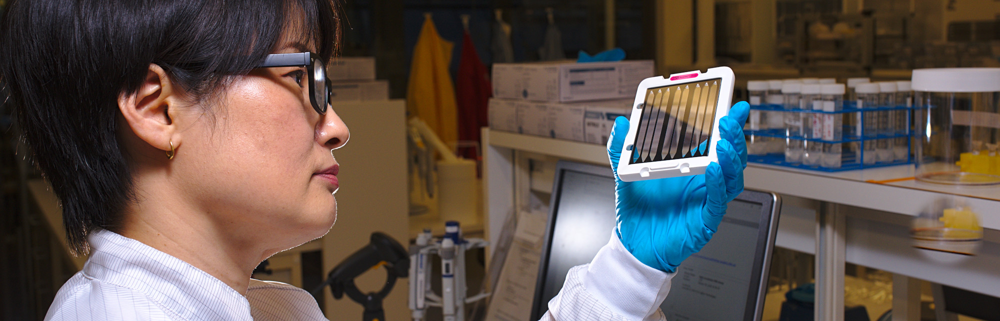
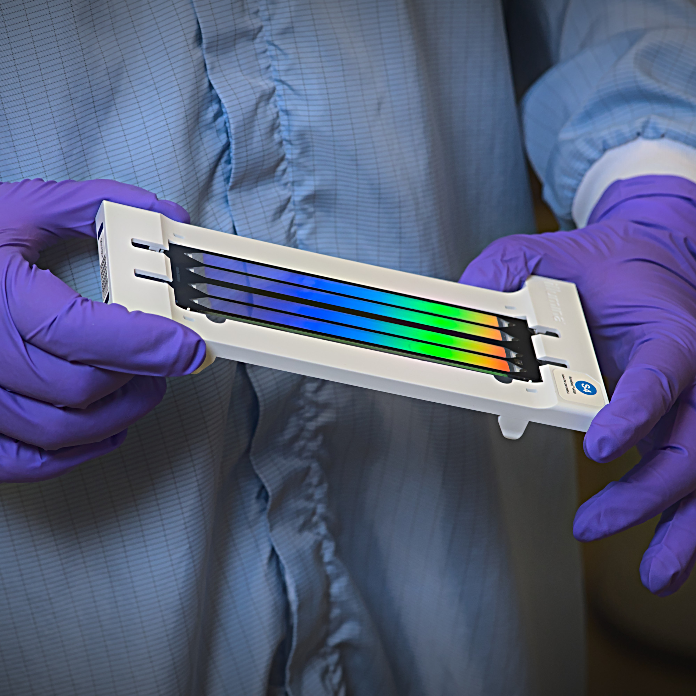
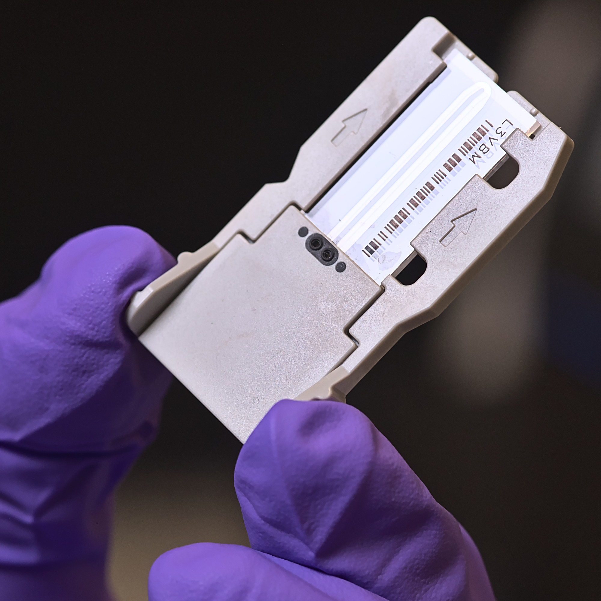
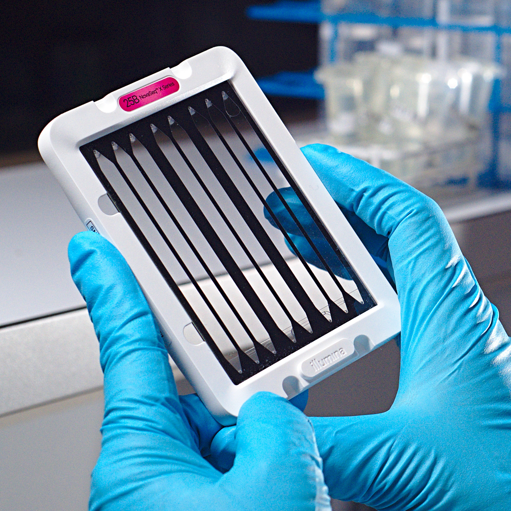

# 2001: A Base Odyssey
***The era of genomics and massive parallel sequencing***

This repository contains the slides, literature, and figures for the talk "2001: A Base Odyssey" about the era of genomics and massive parallel sequencing. It was delivered on February 23, 2026, by [Matthias Zepper](https://www.linkedin.com/in/matthias-zepper-05b752212/) at [SciLifeLab](https://www.scilifelab.se) in Stockholm.

The presentation explores the history and advancements in DNA sequencing, covering various next-generation sequencing (NGS) technologies, the data analysis and sequencing applications.

## Presentation slides

- The [presentation slides rendered to PDF](./SciLifeLab_2001ABaseOdyssey.pdf)
- The source file for the presentation is [`SciLifeLab_2001ABaseOdyssey.tex`](./SciLifeLab_2001ABaseOdyssey.tex).

To compile the slides, ensure you have LaTeX with Beamer installed. You will need BibLaTeX/Biber for bibliography management. Compile using `lualatex` or `xelatex` followed by `biber` and another LaTeX run.

> [!NOTE]
> The custom [_SciLifeLab_ theme](https://github.com/MatthiasZepper/beamer-scilifelab) is included in the repository. It uses the colors of [the official visual guide](https://www.scilifelab.se/community-pages/resources/visual-identity/), but not the font faces. The theme replaces Lato/Lora with [Biolinum by Philipp H. Poll](https://en.wikipedia.org/wiki/Linux_Libertine), which you may [have to install separately](https://ctan.org/pkg/libertine).

## Repository Structure

- **`./literature/`**: Includes the bibliography file `base-odyssey.bib` with references cited in the presentation.
- **`./figures/`**: Contains images and figures used in the slides.

## Summary of Presentation Content

1. **2001: Draft assemblies of the human genome are published**: Introduces the publication of the public and private draft human genomes as the overture to the genomic era, framed with a nod to Kubrick's *2001: A Space Odyssey*.
2. **From genetic code to DNA sequencing (1968-1980)**: Reviews the 1968 Nobel prize for decoding the genetic code, the early challenge that natural DNA sequence information was still unknown, and Frederick Sanger's 1977 chain-termination method with its 1980 Nobel recognition.
3. **Advanced Sanger sequencing for the Human Genome Project**: Shows how fluorescent labeling, capillary electrophoresis, automation, and parallelization enabled large-scale sequencing in the HGP era.
4. **Rise of next-generation sequencing (NGS)**: Explains the transition from Sanger to high-throughput massive-parallel sequencing, flow cells, and the dramatic drop in sequencing costs.
5. **Sequencing platforms and technologies since Sanger**: Compares major platform classes and principles.
    - Illumina short-read sequencing by synthesis
    - PacBio long-read single-molecule sequencing by synthesis
    - Oxford Nanopore pore-based electrical signal sequencing
6. **Sequencing data handling and analysis**: Covers sequencing output (FastQ), core bioinformatic strategies, and scalable processing.
    - Pairwise alignment, quasi-mapping, and de novo assembly
    - Data pipelines and workflow managers (for example nf-core)
7. **Sequencing applications - from function to environment to evolution**: Organizes applications into three major domains.
    - Characterizing genetic (mal)function (epigenetics, transcriptomics, cancer genomics, single-cell and spatial methods)
    - Exploring what is around us (infectious disease monitoring, metagenomics, microbiome research)
    - Elucidating evolutionary processes (ancient DNA, population genomics, biodiversity and agrigenomics)
8. **Milestones and outlook**: Revisits key milestones in sequencing history and highlights where the field is currently heading.
9. **National Genomics Infrastructure (NGI) Sweden**: Concludes with NGI's role as SciLifeLab's sequencing infrastructure, including platform capacity and support for research projects in Sweden.

## License

All original content in these slides and this repository is released under a [Creative Commons Attribution 4.0 International License](https://creativecommons.org/licenses/by/4.0/). However, certain copyrighted images, including figures and works of art by third parties, are used under Fair Use for nonprofit educational purposes and are not covered by this license.

