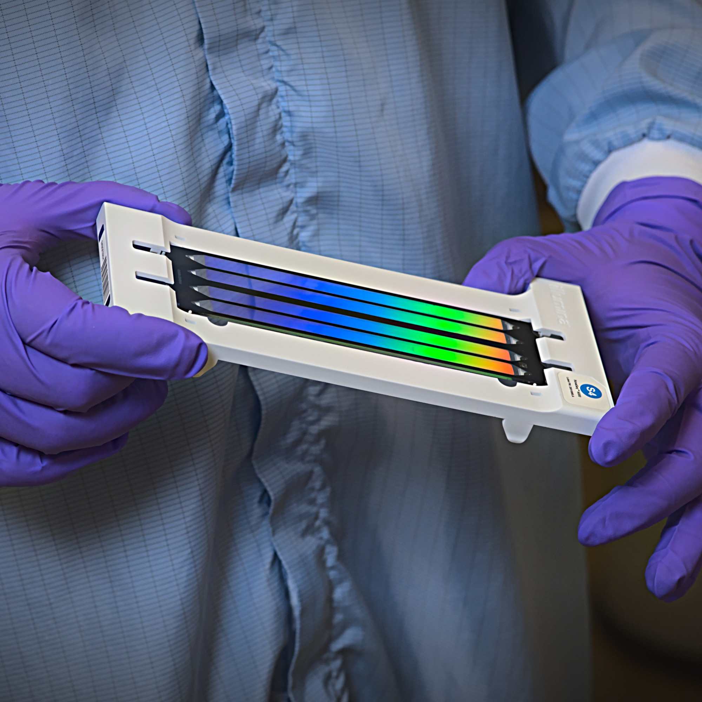

# 2001: A Base Odyssey
***The era of genomics and massive parallel sequencing***

This repository contains the slides, literature, and figures for the talk "2001: A Base Odyssey" about the era of genomics and massive parallel sequencing. It was delivered on February 24, 2025, by [Matthias Zepper](https://www.linkedin.com/in/matthias-zepper-05b752212/) at [SciLifeLab](https://www.scilifelab.se) in Stockholm.

The presentation explores the history and advancements in DNA sequencing, covering various next-generation sequencing (NGS) technologies, the data analysis and sequencing applications.

## Presentation slides

- The [presentation slides rendered to PDF](./SciLifeLab_2001ABaseOdyssey.pdf)
- The source file for the presentation is [`SciLifeLab_2001ABaseOdyssey.tex`](./SciLifeLab_2001ABaseOdyssey.tex).

To compile the slides, ensure you have LaTeX with Beamer installed. You will need BibLaTeX/Biber for bibliography management. Compile using `lualatex` or `xelatex` followed by `biber` and another LaTeX run.

> [!NOTE]
> The custom [_SciLifeLab_ theme](https://github.com/MatthiasZepper/beamer-scilifelab) is included in the repository. It uses the colors of [the official visual guide](https://www.scilifelab.se/community-pages/resources/visual-identity/), but not the font faces. The theme replaces Lato/Lora with [Biolinum by Philipp H. Poll](https://en.wikipedia.org/wiki/Linux_Libertine), which you may [have to install separately](https://ctan.org/pkg/libertine).

## Repository Structure

- **`./literature/`**: Includes the bibliography file `base-odyssey.bib` with references cited in the presentation.
- **`./figures/`**: Contains images and figures used in the slides.

## Summary of Presentation Content

1. **2001: Draft assemblies of the human genome are published**: Discusses the publication of the draft sequence of the human genome. With a reference to Stanley Kubrick's "2001: A Space Odyssey.", this can be considered as **the overture to the genomic era**. Jumping back to the production year of the film, the **1968: Nobel prize for the interpretation of the genetic code** is mentioned.
2. At that time **encoded information of naturally occurring DNA was unknown**. Discusses the challenges of sequencing DNA in the early 1970s and explains the development of the **chain-termination sequencing method** by Frederick Sanger.
3. Coming full circle, **advanced Sanger sequencing for the Human Genome Project** describes the advancements in Sanger sequencing used in the Human Genome Project.
4. A primer on **next-generation sequencing** demonstrates how the new high-throughput sequencing methods make sequencing affordable for single research groups.
5. The concept of sequencing facilities is introduced by example of the **National Genomics Infrastructure Sweden**.
6. **Sequencing platforms**: Discusses various sequencing platforms and technologies used since Sanger sequencing.
    - Illumina (Solexa) sequencing
    - PacBio HiFi Sequencing
    - Oxford Nanopore sequencing
7. **Sequencing data handling**: Covers the handling and quality control of sequencing data.
    - Quality control: Good data vs. Poor data
    - Common bioinformatic analyses: Assembly, alignment and quasi-mapping.
    - Data pipelines and workflow managers
8. **Sequencing applications**: Explores various applications of sequencing in characterizing genetic (mal)function, exploring the environment, and elucidating evolutionary processes.
    - Gene expression / Transcriptomics (RNA-seq, CAGE-seq)
    - Gene regulation / Epigenetics (DNA-Methylation, Histone modifications)
    - Gene alterations (Hereditary diseases, cancer biology)
    - Genome assemblies of other species (biodiversity)
    - Metagenomics and environmental DNA
    - Pathogen surveillance (antibiotic resistance, epidemics)
    - Ancient genomes
    - Population genomics
    - Genome assemblies of other species (biodiversity)

## License

All original content in these slides and this repository is released under a [Creative Commons Attribution 4.0 International License](https://creativecommons.org/licenses/by/4.0/). However, certain copyrighted images, including figures and works of art by third parties, are used under Fair Use for nonprofit educational purposes and are not covered by this license.

